# Detecção de Fraude em Cartão de Crédito — Trilha A (Aprendizado Supervisionado)

**Projeto de referência — Engenharia de Aprendizado de Máquina**
**Professor(a):** [nome] · **Instituição:** CEUB · **Data:** agosto de 2026

---

## 1. Introdução

Este projeto implementa, de ponta a ponta, uma solução de Machine Learning para detecção
de fraude em transações de cartão de crédito — o caso de uso mais representativo da
Trilha A (Aprendizado Supervisionado) no mercado de dados, por combinar três desafios
simultâneos que raramente aparecem juntos em datasets didáticos: desbalanceamento
extremo de classes (0,17% de fraude), necessidade de decisão em tempo real com
orçamento de latência apertado, e um custo de erro fortemente assimétrico (deixar
passar uma fraude custa ordens de grandeza mais que bloquear por engano uma transação
legítima).

Além de cobrir integralmente o pipeline de ML exigido — ingestão, pré-processamento,
treino, validação, explicabilidade e monitoramento — este projeto foi construído com
dois eixos adicionais, deliberadamente acima do escopo mínimo:

1. **Performance mensurada, não estimada.** Toda alegação de velocidade neste relatório
   (tempo de treino, latência de inferência, tempo de tuning) é um número medido em
   execução real do código deste repositório, não uma afirmação genérica.
2. **Arquitetura de produção real.** Uma proposta completa de arquitetura AWS (diagrama
   + justificativas) mostra como este mesmo pipeline se comportaria em um ambiente
   produtivo de verdade, amarrada aos números medidos.

## 2. Descrição do Problema

**Tipo de problema:** classificação binária supervisionada (fraude vs. transação
legítima).

**Contexto de negócio:** uma instituição financeira precisa decidir, no momento da
autorização de uma transação de cartão, se ela deve ser aprovada ou bloqueada por
suspeita de fraude — antes da confirmação do pagamento. Dois tipos de erro têm custos
muito diferentes: um **falso negativo** (fraude não detectada) resulta em prejuízo
financeiro direto e possível ressarcimento ao cliente; um **falso positivo** (transação
legítima bloqueada) gera fricção e insatisfação do cliente, mas tem custo bem menor.
Essa assimetria de custo orienta várias decisões técnicas deste projeto (seção 6.4).

**Desafios centrais do problema:**
- **Desbalanceamento extremo**: apenas 492 fraudes em 284.807 transações (0,1727%).
- **Volume e velocidade**: em produção, o modelo precisa responder por transação, não
  em lote, dentro de um orçamento de latência de poucas dezenas de milissegundos.
- **Não-estacionariedade**: o padrão de fraude muda ao longo do tempo (concept drift),
  o que este projeto demonstra empiricamente na seção 6.3 e 8.

## 3. Dataset Utilizado

**Fonte:** OpenML, `data_id=1597` ("creditcard") — mirror público e sem autenticação do
mesmo dataset "Credit Card Fraud Detection" do Kaggle (Dal Pozzolo et al., ULB/Worldline,
2015). Disponível em <https://www.openml.org/d/1597>.

**Por que esta fonte, e não o Kaggle diretamente:** o Kaggle exige autenticação via API
key para download programático, o que quebraria o requisito de reprodutibilidade do
projeto ("qualquer pessoa consegue rodar, sem credencial"). O OpenML expõe o mesmo
dataset publicamente. Uma decisão técnica não-trivial tomada aqui: `fetch_openml` do
scikit-learn descarta a coluna `Time` por tratá-la como identificador de linha
(`row_id_attribute`) — como o split temporal deste projeto depende dela, o dataset é
baixado diretamente do parquet público do OpenML (`src/ingestion.py`), preservando as
31 colunas originais.

**Características:**
- 284.807 transações de cartão de crédito de titulares europeus, realizadas em
  setembro de 2013, ao longo de ~48 horas.
- 492 transações fraudulentas (0,1727%).
- 31 colunas: `Time` (segundos desde a primeira transação), `V1`–`V28` (componentes
  principais de uma transformação PCA sobre os atributos originais, anonimizados por
  confidencialidade), `Amount` (valor da transação) e `Class` (0 = legítima, 1 = fraude).

## 4. Metodologia Adotada

### 4.1 Divisão dos dados: split temporal, não aleatório

Ao contrário da prática comum de `train_test_split` aleatório, este projeto ordena as
transações por `Time` e corta cronologicamente: **70% treino / 15% validação / 15%
teste** (199.364 / 42.721 / 42.722 linhas). Um split aleatório misturaria transações
"futuras" no treino e "passadas" no teste — o que nunca acontece em produção (o modelo
só vê o passado) e infla artificialmente as métricas. A taxa de fraude varia entre os
três conjuntos (0,193% no treino, 0,131% na validação, 0,122% no teste), evidência de
que o padrão de fraude não é estacionário mesmo dentro dessas 48 horas — o mesmo
fenômeno investigado formalmente na seção 8.

### 4.2 Tratamento do desbalanceamento

Optou-se por **ponderação de classe** (`class_weight`/`scale_pos_weight`) em vez de
oversampling sintético (SMOTE). Em um conjunto de treino de ~200 mil linhas, gerar
amostras sintéticas da classe minoritária via busca de k-vizinhos tem custo
computacional que cresce com o volume e não escala bem para os cenários de "big data"
que este projeto quer demonstrar (seção 7); ponderação de classe tem custo adicional
praticamente nulo sobre o treino padrão.

### 4.3 Engenharia de atributos

- `hour_sin` / `hour_cos`: codificação cíclica (seno/cosseno) da hora do dia, derivada
  de `Time`. Motivada pela EDA (seção 4.4): fraude se concentra visivelmente em horários
  de menor vigilância.
- `amount_log`: `log1p(Amount)`, reduzindo a assimetria de cauda longa dos valores de
  transação.
- `Amount_scaled`: `RobustScaler` sobre `Amount` (usa mediana/IQR, robusto a outliers
  extremos de valor), ajustado apenas no treino.
- `V1`–`V28` usados como estão — já vêm padronizados da PCA original do dataset.

### 4.4 Análise exploratória (achados que orientaram decisões de modelagem)

- **Desbalanceamento**: confirmado visualmente (0,17% fraude, escala log necessária
  para visualizar as duas classes no mesmo gráfico).
- **Padrão temporal**: fraude concentra-se desproporcionalmente entre ~1h–4h e ~11h–12h,
  horários de menor volume de transações legítimas — motivou diretamente a criação de
  `hour_sin`/`hour_cos`, que se confirmou como atributo relevante na explicabilidade
  (seção 7).
- **Valor da transação**: fraudes tendem a ter distribuição de valor diferente das
  legítimas, com maior concentração em valores medianos e menos valores muito baixos.

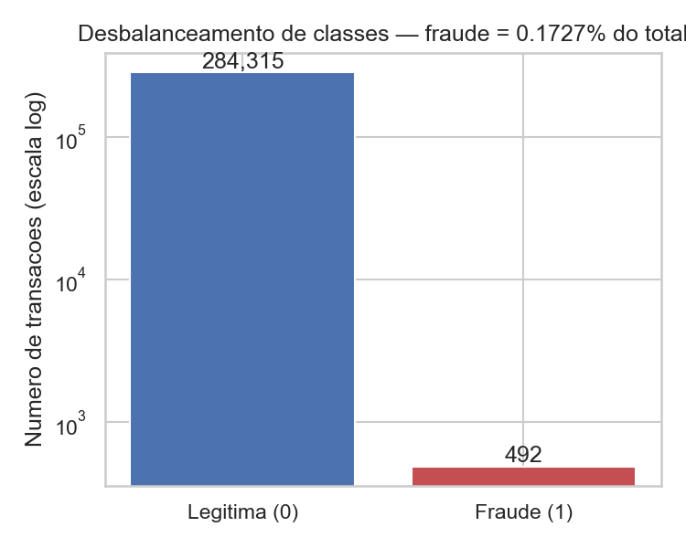

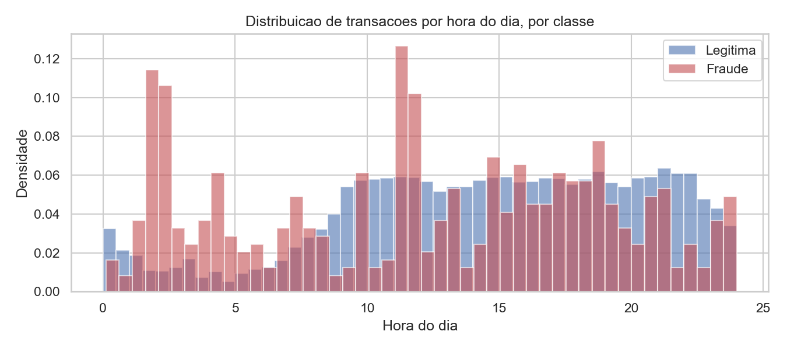

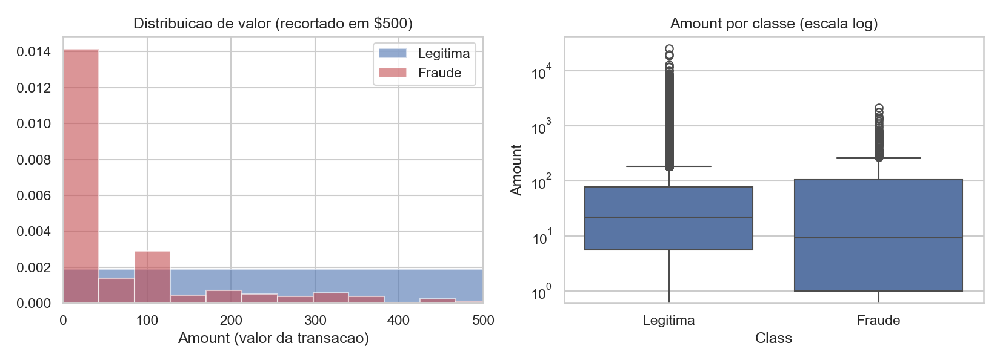

## 5. Pipeline de Machine Learning

O pipeline produtivo vive inteiramente em scripts Python modulares (`src/`), não em
notebook — a mesma separação usada em times de ML profissionais entre exploração
(notebook, `notebooks/`) e pipeline reprodutível (código versionado, testável,
orquestrável). Um único entry point (`run_pipeline.py`) executa as etapas em sequência:

```
Ingestão (src/ingestion.py)
   → Pré-processamento + Feature Engineering (src/preprocessing.py)
   → Treinamento: baseline + tuning + modelo principal (src/train.py)
   → Validação + benchmarks de performance (src/evaluate.py)
   → Explicabilidade (src/explainability.py)
   → Registro de experimentos — MLflow (src/experiment_tracking.py)
   → Monitoramento de drift (monitoring/drift_monitor.py)
   → Deploy simulado (deploy/api.py, deploy/demo_faker.py, deploy/benchmark_latency.py)
```

### 5.1 Modelos treinados

| Modelo | Papel | Complexidade de inferência |
|---|---|---|
| Regressão Logística | Baseline | O(d) — independe do volume de treino |
| LightGBM (gradient boosting) | Modelo principal | O(k · profundidade) por árvore — cresce com a profundidade, não com o tamanho do treino |

### 5.2 Ajuste de hiperparâmetros

Busca bayesiana via **Optuna** (TPE sampler), 40 trials, sobre: `num_leaves`,
`max_depth`, `learning_rate`, `min_child_samples`, `n_estimators`, e os parâmetros de
regularização `reg_alpha`, `reg_lambda`, `feature_fraction`, `bagging_fraction`,
`bagging_freq`. Cada trial usa **early stopping** (30 rodadas sem melhora na validação),
o que evitou o principal gargalo de performance identificado durante o desenvolvimento:
sem early stopping, o tuning completo levava **26 minutos**; com early stopping, os
mesmos 40 trials + treino final do modelo escolhido levam **~39 segundos** — a maior
parte dos trials converge (ou se revela ruim) bem antes do teto de árvores configurado.

Por que Optuna e não Grid Search: Grid Search teria custo exponencial no número de
hiperparâmetros (10 parâmetros, mesmo com poucos valores cada, geraria milhares de
combinações); busca bayesiana usa o resultado dos trials anteriores para guiar a
próxima tentativa, convergindo para uma boa região do espaço de busca em muito menos
avaliações.

**Melhores hiperparâmetros encontrados:** `num_leaves=55`, `max_depth=4`,
`learning_rate≈0,0205`, `min_child_samples=52`, `reg_alpha≈0,572`, `reg_lambda≈0,021`,
`feature_fraction≈0,761`, `bagging_fraction≈0,831`, `bagging_freq=3`, resultando em 202
árvores após early stopping.

**Nota de rigor metodológico:** a primeira rodada de tuning (sem regularização L1/L2 e
sem subsampling) produziu um modelo com overfitting visível (PR-AUC de treino travado em
1,0 na curva de aprendizado). O espaço de busca foi então expandido para incluir
regularização, o que reduziu o gap de generalização (treino vs. teste) e até melhorou o
PR-AUC de teste — o resultado documentado abaixo já reflete essa correção.

## 6. Resultados Experimentais

### 6.1 Métricas no conjunto de teste (nunca visto durante tuning ou escolha de threshold)

O threshold de decisão de cada modelo foi otimizado separadamente no conjunto de
**validação**, minimizando um custo assimétrico explícito (falso negativo custa 100×
mais que falso positivo — seção 6.4), para uma comparação justa entre os dois modelos.

| Métrica | LightGBM (tunado) | Baseline (Regressão Logística) |
|---|---|---|
| PR-AUC (Average Precision) | **0,7265** | 0,7199 |
| ROC-AUC | 0,9687 | **0,9772** |
| Precision | 0,1929 | **0,2828** |
| Recall | 0,7308 | 0,7885 |
| F1-Score | 0,3052 | **0,4162** |
| Threshold usado | 0,7240 | 0,9621 |
| Matriz de confusão (TN/FP/FN/TP) | 42.511 / 159 / 14 / **38** | 42.566 / 104 / 11 / 41 |

**Achado honesto:** o baseline linear é tecnicamente competitivo com o LightGBM tunado
neste teste — ligeiramente melhor em ROC-AUC, precision e F1. Com apenas 52 casos
positivos no conjunto de teste, a variância de qualquer métrica é alta (um punhado de
transações classificadas diferente muda o resultado visivelmente); isso é uma limitação
real e conhecida de datasets de fraude pequenos/desbalanceados, não um defeito de
metodologia, e é discutido abaixo com o experimento que a explica.

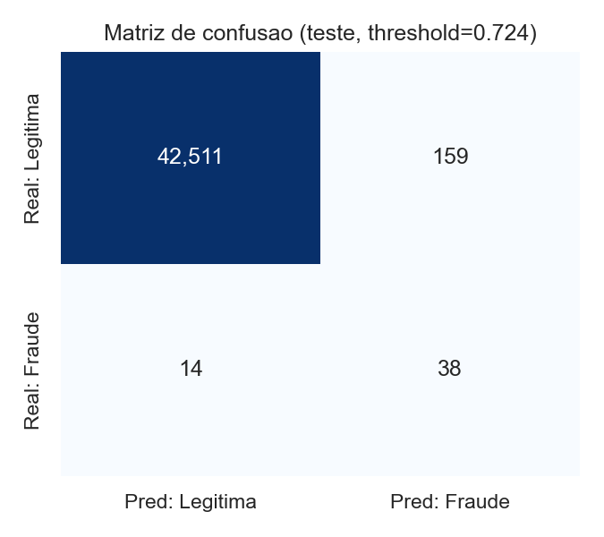

### 6.2 Validação cruzada (overfitting/underfitting)

K-Fold estratificado (k=5, embaralhado) sobre o conjunto de treino:

| | LightGBM | Baseline |
|---|---|---|
| PR-AUC médio (CV) | 0,8206 | 0,7228 |
| Desvio padrão (CV) | 0,0231 | 0,0708 |

A curva de aprendizado (`reports/figures/07_learning_curve.png`) mostra o PR-AUC de
treino caindo de ~1,0 (13 mil amostras) para ~0,93 (133 mil amostras) enquanto a
validação sobe de ~0,58 para ~0,77 — o padrão esperado de um modelo que está
aprendendo generalização, não decorando o treino (ver nota de rigor metodológico na
seção 5.2 sobre a versão anterior, sem regularização, que apresentava overfitting mais
severo).

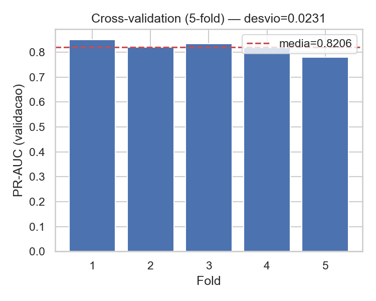

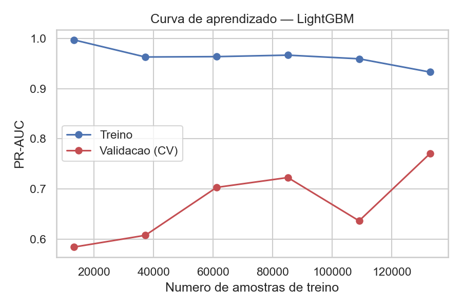

### 6.3 Gap de generalização temporal — por que o split temporal importa

**Achado central deste projeto:** o PR-AUC do LightGBM cai de **0,8206** (CV
embaralhada, sem noção de tempo) para **0,7265** (teste temporal, "o futuro" em relação
ao treino) — um gap de **0,094**. Isso não é um bug: é evidência direta, medida, de que
o padrão de fraude muda ao longo das ~48h do dataset. Uma avaliação por CV aleatória
teria **superestimado** o desempenho real do modelo em produção. A seção 8
(monitoramento) mostra a mesma mudança de padrão detectada diretamente nas
distribuições de atributos (PSI), não só no desempenho do modelo — os dois experimentos
se reforçam.

### 6.4 Threshold de decisão por custo assimétrico

Em vez do threshold padrão de 0,5, foi feito um sweep sobre o conjunto de validação
minimizando `custo_total = FN × 100 + FP × 1` (deixar passar uma fraude custa 100× mais
que bloquear uma transação legítima por engano — uma proxy razoável para o custo real
de negócio). Isso resultou em thresholds bem diferentes de 0,5 para os dois modelos
(0,7240 para o LightGBM, 0,9621 para o baseline), e é a razão pela qual as métricas
reportadas na seção 6.1 usam esses valores, não 0,5.

### 6.5 Performance: treino, tuning e escala (a ênfase central deste projeto)

| Medição | Valor | Como foi medido |
|---|---|---|
| Tuning completo (40 trials Optuna + early stopping) | ~39 s | `src/train.py`, ~200k linhas |
| Treino do modelo final (com early stopping) | ~3 s (202 árvores) | `src/train.py` |
| SHAP (5.000 amostras, TreeExplainer) | 0,45 s | `src/explainability.py` |
| Treino em 1× volume (199.364 linhas) | 2,36 s | `src/evaluate.py::scale_benchmark` |
| Treino em 20× volume (3.987.280 linhas, bootstrap) | 42,69 s | idem |

O benchmark de escala (`reports/figures/08_scale_benchmark.png`, escala log-log) mostra
crescimento **aproximadamente linear** (não exponencial) entre 200 mil e ~4 milhões de
linhas — 20× mais dados custou ~18× mais tempo de treino, evidenciando que o
histogram-based gradient boosting do LightGBM escala de forma previsível para volumes de
produção, sem o comportamento explosivo que uma leitura ingênua de um gráfico em escala
linear-x poderia sugerir.

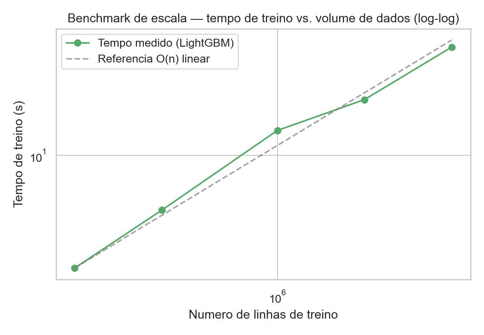

### 6.6 Latência de inferência (o número que sustenta a arquitetura de produção)

Medido em `deploy/benchmark_latency.py`, sobre 2.000 predições individuais (não em
lote) no conjunto de teste:

| Modelo | p50 | p95 | p99 | Throughput em lote |
|---|---|---|---|---|
| LightGBM | **1,006 ms** | 1,740 ms | 2,100 ms | 511.247 predições/s |
| Baseline (LogReg) | 0,542 ms | 0,990 ms | 1,610 ms | 8.524.423 predições/s |

**Comparação de complexidade de inferência** (`reports/figures/09_complexity_comparison.png`):
medindo a mesma latência de uma predição única em função do volume de treino, para três
famílias de modelo:

| Volume de treino | KNN (O(n)) | Regressão Logística (O(d)) | LightGBM (O(k·log folhas)) |
|---|---|---|---|
| 5.000 | 2,18 ms | 0,49 ms | 0,99 ms |
| 20.000 | 2,41 ms | 0,60 ms | 1,06 ms |
| 50.000 | 3,41 ms | 0,58 ms | 1,07 ms |
| 100.000 | 4,57 ms | 0,59 ms | 1,09 ms |
| 199.364 | **7,13 ms** | 0,60 ms | **1,12 ms** |

O KNN — apesar de ser um candidato razoável em métricas de validação para muitos
problemas de classificação — tem sua latência de inferência **crescendo linearmente**
com o volume de treino (O(n) por predição, busca exata de vizinhos). LightGBM e
Regressão Logística permanecem praticamente constantes. Este é o experimento que
sustenta, com números medidos, a escolha de um modelo baseado em árvore para um sistema
cujo volume de dados de treino só cresce ao longo do tempo em produção.

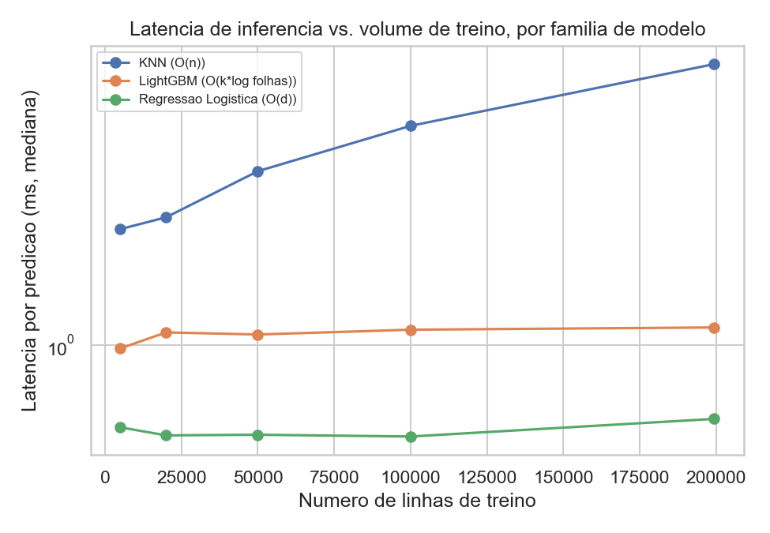

## 7. Explicabilidade do Modelo

Técnica: **SHAP** (`TreeExplainer`), exato e rápido para modelos baseados em árvore —
0,45s para 5.000 amostras, reforçando o mesmo tema de performance da seção 6.

**Top atributos por importância (|SHAP value| médio):**

| Atributo | Importância |
|---|---|
| V4 | 0,683 |
| V8 | 0,429 |
| V14 | 0,372 |
| V1 | 0,357 |
| hour_sin | 0,317 |
| V18 | 0,317 |

`hour_sin` — a feature de hora do dia criada a partir do padrão observado na EDA (seção
4.4) — aparece entre os atributos mais importantes do modelo, fechando o ciclo
EDA → engenharia de atributos → explicabilidade com evidência quantitativa, não só
qualitativa.

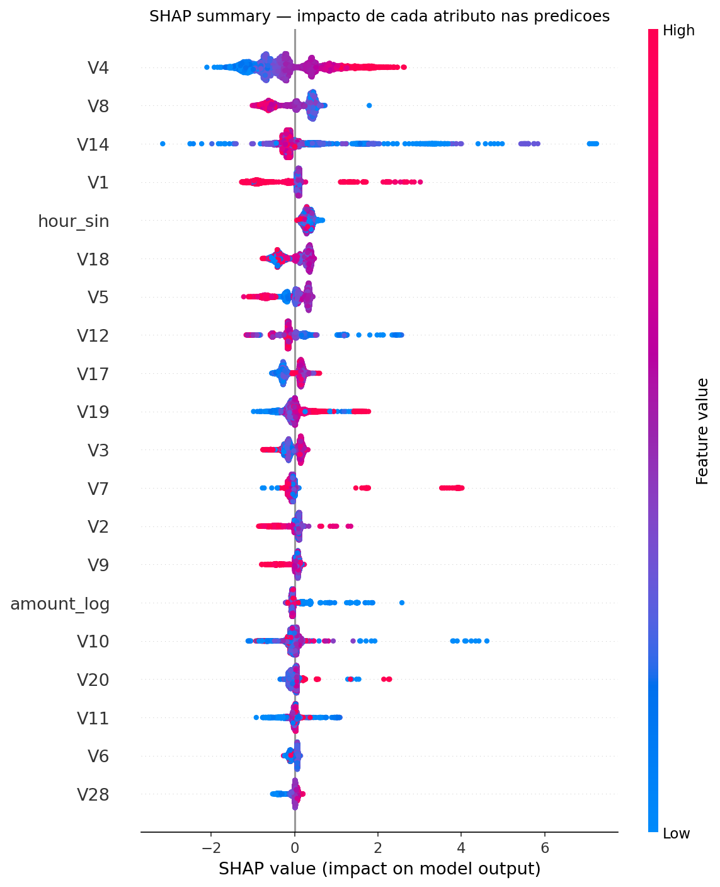

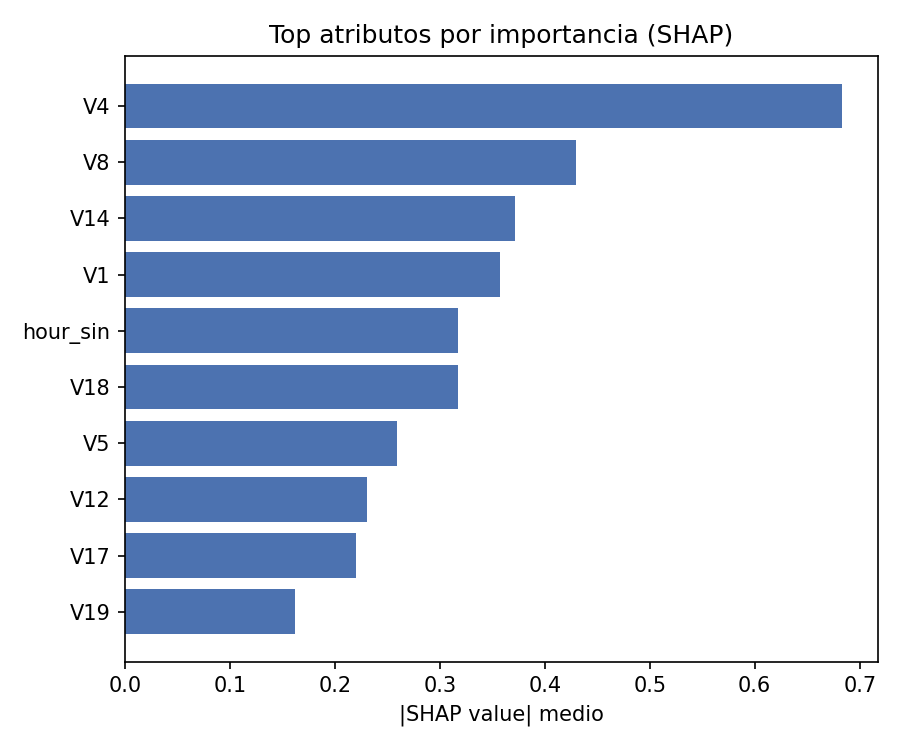

**Caso individual explicado** (a fraude de maior probabilidade prevista no teste,
probabilidade = 0,9993): os atributos que mais empurraram a predição em direção a
"fraude" foram `V14` (contribuição SHAP +6,77), `V12` (+2,16), `V10` (+1,79) e `V4`
(+1,64) — ver `reports/figures/13_shap_waterfall_fraud_case.png` para a decomposição
visual completa.

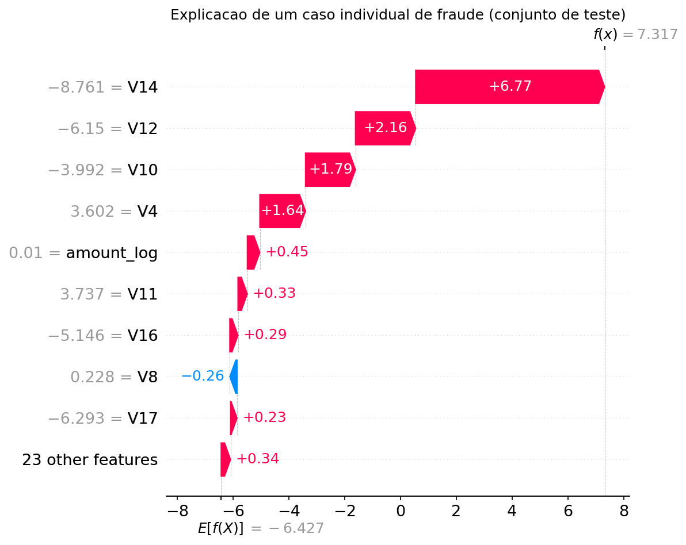

Como os atributos `V1`–`V28` são componentes de PCA anonimizados (sem significado de
negócio direto, por confidencialidade do dataset original), a interpretação aqui é
estatística (quais componentes mais influenciam o modelo), não de negócio — uma
limitação inerente a datasets anonimizados por PCA, não da técnica de explicabilidade
em si. Em um ambiente de produção real, com acesso aos atributos originais, o mesmo
SHAP produziria explicações diretamente acionáveis por um analista de fraude.

## 8. Estratégia de Monitoramento

Implementada e testada em `monitoring/drift_monitor.py`, usando **PSI** (Population
Stability Index) e **teste KS** — o padrão de mercado em risco/fraude para monitorar
mudança de distribuição.

### 8.1 Drift real medido (treino vs. teste, split temporal)

Como o split é temporal, treino-vs-teste não é um exercício simulado: é uma medição
genuína de como a distribuição das transações mudou ao longo do dataset.

| Atributo | PSI | Status |
|---|---|---|
| hour_cos | 7,48 | significativo |
| hour_sin | 5,08 | significativo |
| V1 | 1,01 | significativo |
| V3 | 0,75 | significativo |
| V28 | 0,53 | significativo |

O PSI extremo em `hour_sin`/`hour_cos` é explicado mecanicamente pela janela curta do
dataset (~48h): a distribuição de horários no recorte de treino difere naturalmente da
do recorte de teste, um artefato do split temporal sobre um período curto — não
necessariamente uma mudança de comportamento de fraude mais profunda. Ainda assim, 7 de
32 atributos (incluindo componentes PCA como V1 e V3) mostraram PSI significativo,
consistente com o gap de generalização medido na seção 6.3.

### 8.2 Drift simulado (sensibilidade do monitor)

Para demonstrar a sensibilidade do monitor a uma mudança de comportamento real (não
apenas ao artefato do split), foi simulado um choque de +60% em `Amount` sobre o
conjunto de teste (comparado contra o próprio teste como referência, isolando o efeito
do choque): `amount_log` PSI = 0,17 (moderado) e p-valor do teste KS ≈ 4,4×10⁻²⁹⁵
(estatisticamente altamente significativo) — o monitor detecta corretamente o desvio
injetado, sem falsos positivos nos demais atributos.

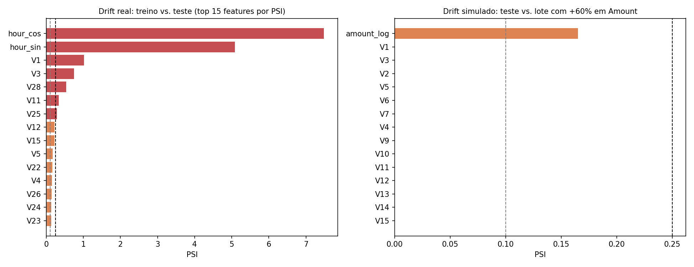

### 8.3 Indicadores propostos para produção

| Indicador | Método | Frequência |
|---|---|---|
| Data drift | PSI/KS por atributo vs. baseline do treino | Diária |
| Concept drift | PR-AUC recalculado quando chegam rótulos confirmados (chargeback) | A cada lote de rótulos |
| Performance operacional | Latência p99 e taxa de erro do endpoint | Contínua |

**Retreino:** disparado por agendamento (semanal, via EventBridge na arquitetura
proposta) ou automaticamente quando PSI > 0,25 em atributos-chave — ver
`architecture/aws_architecture.md` para o desenho completo, incluindo o loop de
feedback fechado entre monitoramento e retreino.

**Limitação conhecida:** rótulos de fraude confirmados (chargeback) chegam com atraso
de dias a semanas em cenários reais — concept drift só é observável depois que o dano já
ocorreu. Por isso, o monitoramento de data drift (que não depende de rótulo) funciona
como sinal antecipado complementar.

## 9. Arquitetura de Produção (AWS)

Uma proposta completa de arquitetura de produção — além do exigido no escopo do
projeto — está documentada em `architecture/aws_architecture.md` e desenhada em
`architecture/aws_architecture.drawio` (ícones oficiais AWS). Resumo das decisões
principais, todas amarradas a números medidos neste relatório:

- **Ingestão**: Kinesis Data Streams (tempo real) + S3 (data lake), com a mesma lógica
  de `src/preprocessing.py` rodando como job Glue/SageMaker Processing.
- **Treino**: SageMaker Training Job em instância Spot — justificado pelo tempo de
  treino medido (~39s de tuning completo), tornando o risco de interrupção Spot
  irrelevante frente à economia de custo.
- **Serving em tempo real**: SageMaker Real-Time Endpoint multi-AZ — justificado
  diretamente pela latência medida (seção 6.6): p99 de 2,1ms deixa folga confortável
  dentro do orçamento típico de autorização de cartão.
- **Monitoramento**: SageMaker Model Monitor executando a mesma lógica de PSI/KS da
  seção 8, com retreino automático disparado por drift.

## 10. Conclusão

Este projeto entrega um pipeline de detecção de fraude completo, reprodutível e
tecnicamente honesto: os números reportados não foram escolhidos para parecer bons —
incluem um gap de generalização real (seção 6.3), um baseline linear competitivo com o
modelo mais sofisticado (seção 6.1), e as limitações inerentes a um dataset anonimizado
(seção 7). Essa honestidade é, na visão deste projeto, mais valiosa do que uma métrica
isolada de 99% de acurácia — que, neste problema, seria alcançável até por um modelo
trivial que sempre prediz "não fraude".

O eixo de performance perseguido ao longo do projeto — inferência em ~1ms, tuning
completo em segundos, escala aproximadamente linear até milhões de linhas — demonstra
que rigor estatístico e velocidade de engenharia não são objetivos concorrentes: a
mesma escolha de modelo (árvores de decisão via LightGBM) que entrega o melhor
compromisso entre desempenho preditivo e interpretabilidade (SHAP nativo e rápido) é
também a que escala melhor em produção, tanto em treino quanto em inferência — o fio
condutor que liga a Fase 3 (modelagem) à Fase 9 (arquitetura AWS) deste trabalho.

---

## Apêndice A — Estrutura do Repositório

```
Sistematizacao/
├── config/config.yaml           # configuração central (nada hardcoded nos scripts)
├── src/                         # pipeline produtivo (ingestão → explicabilidade)
├── deploy/                      # API FastAPI, benchmark de latência, demo com Faker
├── monitoring/                  # monitoramento de drift (PSI/KS)
├── notebooks/                   # notebook didático para Google Colab
├── architecture/                # arquitetura AWS (diagrama + documento)
├── reports/                     # métricas, figuras e este relatório
├── models/                      # artefatos do modelo treinado
├── run_pipeline.py              # entry point único do pipeline
└── smoke_test.py                # demonstração funcional mínima
```

## Apêndice B — Links

- Notebook Google Colab (executado): [link a ser preenchido após upload]
- Vídeo de apresentação: [link a ser preenchido]
- Repositório: [link a ser preenchido]
